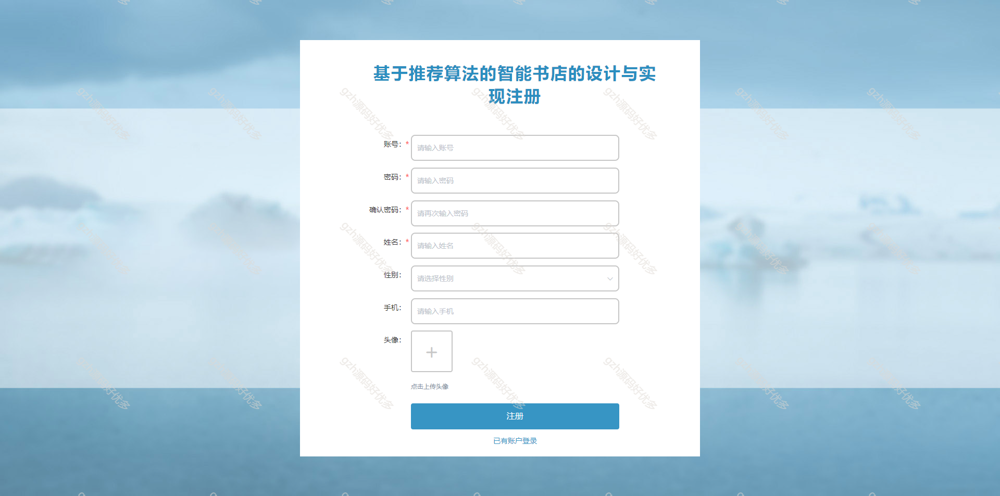
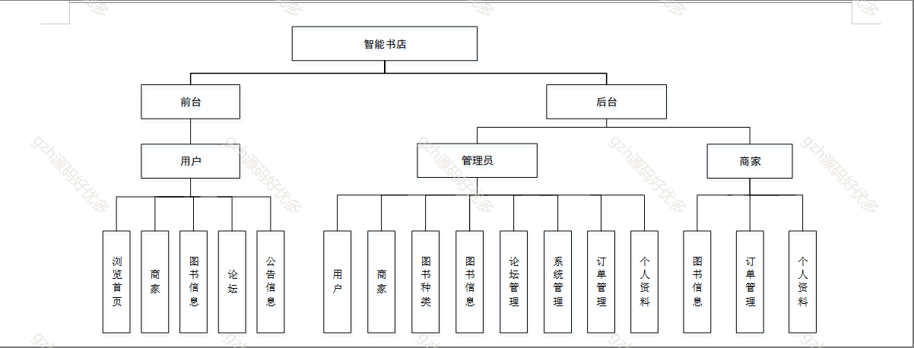
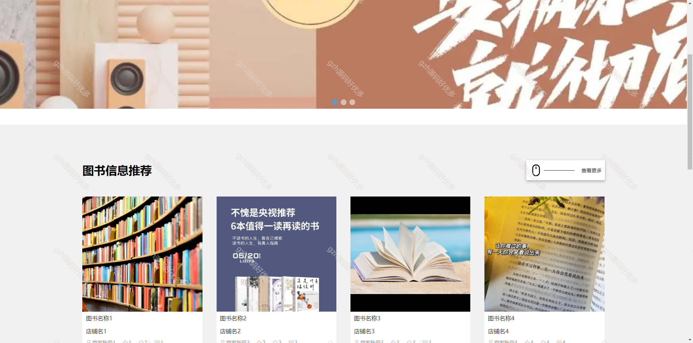
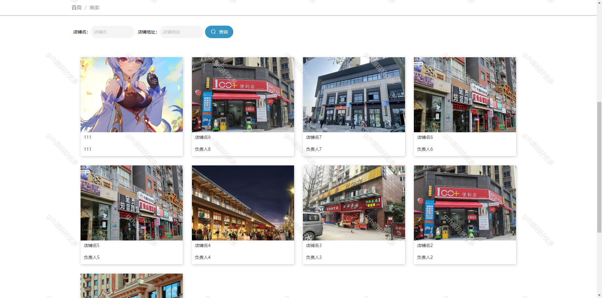
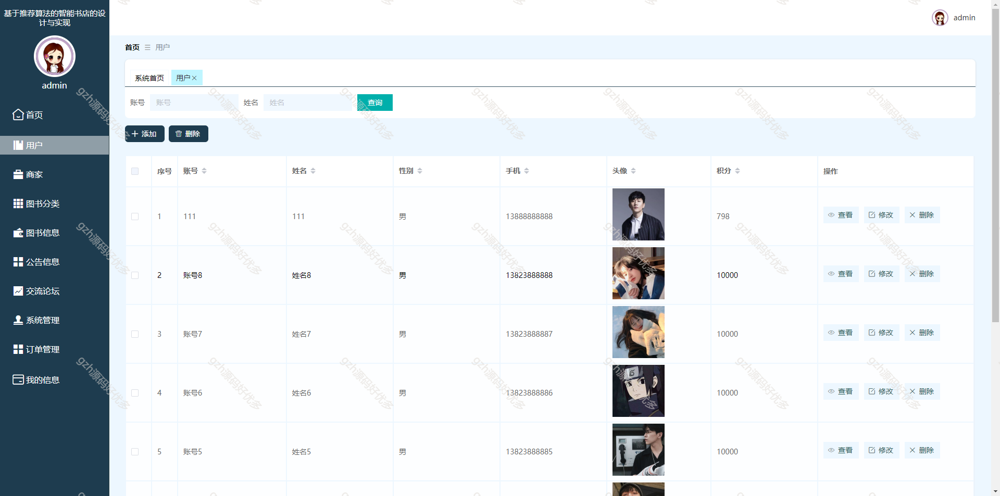
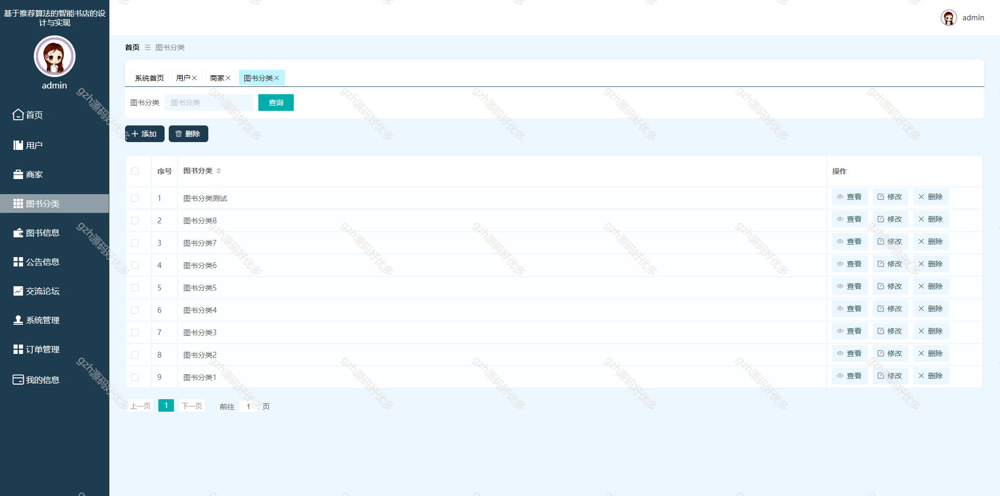
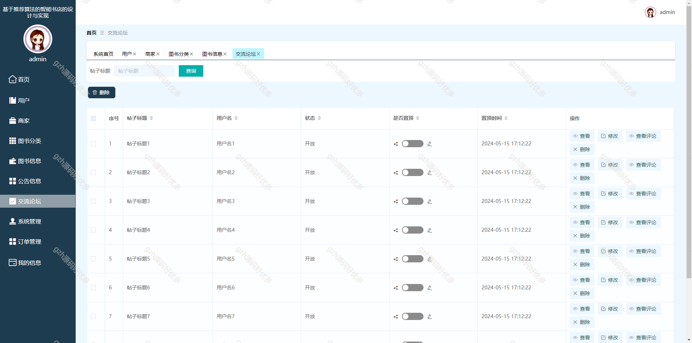
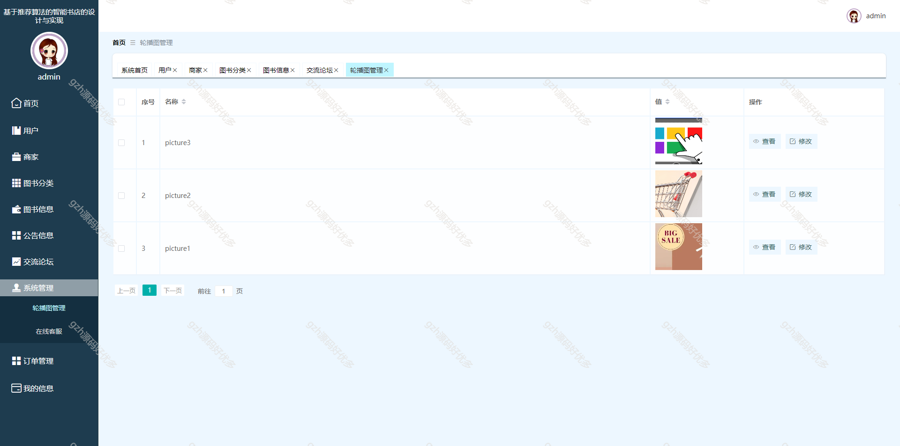
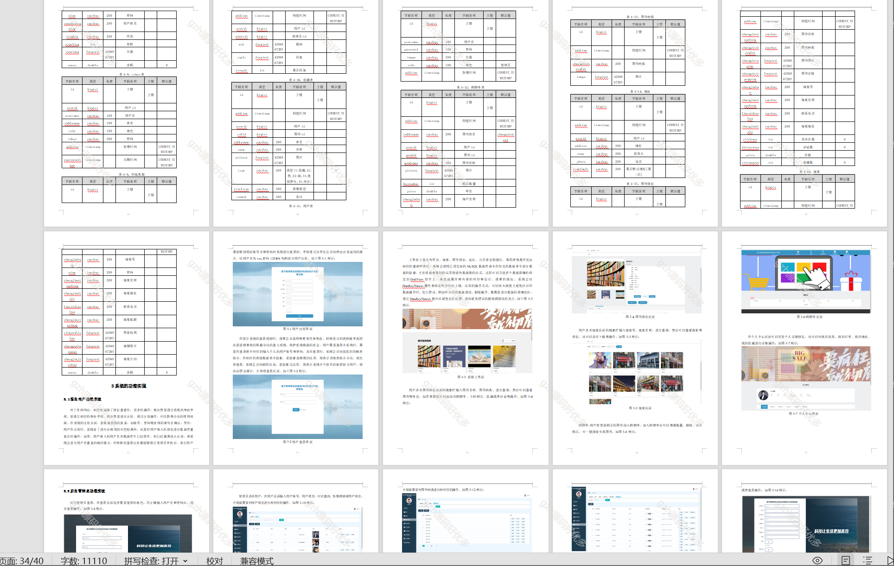

# springbootA364
springbootA364基于协同过滤算法的图书商城系统LW
 
## 查看主页获取源码

### 一、关键词

网上书店、图书销售、图书商城

### 二、作品包含

源码+数据库+设计文档万字+全套环境和工具资源+部署教程

### 三、项目技术

前端技术：Html、Css、Js、Vue2.0、Element-ui 
数据库：MySQL
后端技术：Java、SpringBoot2.0、MyBatis

  

### 四、运行环境

开发工具：IDEA/eclipse  + vscode

数据库：MySQL5.7（最低要5.7版本）

数据库管理工具：Navicat10以上版本

环境配置软件： JDK1.8 + Maven3.6.3

前端Nodejs：14

浏览器：谷歌浏览器

### 五、项目介绍

项目编号：springbootA364

本智能书店开发的目的在于规范购买图书服务，提高效率。以便满足各类型用户的需求，增加的安全性，多样性更加适应现代社会的发展。

角色：管理员、用户、商家

管理员：管理员进入系统主页面，主要功能包括对用户、商家、图书种类、图书信息、论坛管理、系统管理、订单管理、个人资料等进行操作

用户：当游客打开系统的网址后，首先看到的就是首页界面。在这里，游客能够看到导航条显示首页、系统主页、商家、图书信息、公告信息、交流论坛、购物车、在线客服、个人中心等，

商家：商家进入系统主页面，主要功能包括对图书信息、订单管理、个人资料等进行操作。

### 六、运行截图

  
